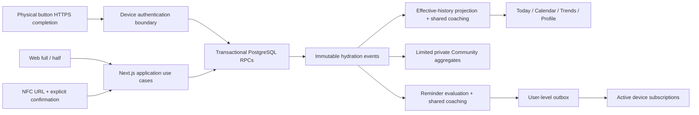

# Architecture

[Documentation hub](README.md) · [Frontend](frontend.md) · [Backend](backend.md)

## One event history, several intentional inputs

The inputs differ in authentication and request shape, not in hydration meaning.
NFC opens a confirmation page. A physical button has already resolved an
intentional completion in firmware. A notification opens a chooser and writes nothing.
All new completion records snapshot their effective volume.

## Code boundaries

| Directory              | Responsibility                                                    | Keep out                                          |
| ---------------------- | ----------------------------------------------------------------- | ------------------------------------------------- |
| `app/`                 | Routes, server-rendered pages, server actions and HTTP boundaries | Independent pace math or trusted client ownership |
| `components/`          | Shared UI, navigation, dialogs, feedback and refresh controls     | Server credentials and cross-user reads           |
| `lib/contracts/`       | Untrusted request schemas and external response types             | Persistence side effects                          |
| `lib/application/`     | Use cases, orchestration, safe errors and revalidation            | A second hydration ledger                         |
| `lib/domain/`          | Deterministic hydration, coaching and username logic              | Browser APIs, network calls and framework state   |
| `lib/infrastructure/`  | Supabase clients, row conversion, RPC adapters and push transport | Presentation-owned numerical rules                |
| `lib/units/`           | Display conversion and integer-ml boundaries                      | Stored ounce totals                               |
| `supabase/migrations/` | Constraints, RLS, grants and atomic database functions            | Runtime credentials                               |

Some cross-user aggregation is intentionally implemented in narrow SQL functions
(e.g. reminder candidates and Community summaries). Test these against the same
effective-event rules; a TypeScript domain helper does not automatically make SQL
aggregation consistent.

## Trust boundaries

There are three authentication paths:

1. **Browser/session:** cookie-backed Supabase SSR session, verified user,
   server email allowlist, owner RLS and owner-scoped RPCs.
2. **Physical device:** dedicated bearer token → server SHA-256 digest → narrow
   device RPC authenticated with an independent server/Vault secret.
3. **Push worker:** bearer scheduler secret → constant-time server comparison →
   narrow Vault-authenticated database RPCs using a publishable-key client.

The last two paths intentionally do not require a browser session. They do not
use a service-role key. Read [Security](security.md) before changing grants,
SECURITY DEFINER functions or credential handling.

## Read and write paths

A Today render verifies access, fetches an owner snapshot through
[hydration.ts](../lib/infrastructure/supabase/hydration.ts), then builds the dashboard
through [hydration-projection.ts](../lib/application/hydration/hydration-projection.ts).
The snapshot includes profile, bottles, goals and event history. Read failures are
errors, not empty successful histories.

A manual/NFC write validates the request, resolves owner and bottle, and calls the
atomic event processor. Physical-device writes enter through a credential-scoped
RPC before reaching that processor. Edits/removals use a separate atomic correction
RPC. Successful writes revalidate shared views via
[revalidate-hydration-views.ts](../lib/application/hydration/revalidate-hydration-views.ts).

## Deployment topology and limitations

Next.js is deployed to Vercel; Auth and PostgreSQL are hosted by Supabase. Cron
and pg_net invoke the worker every 15 minutes. Push providers deliver to the browser's
single root-scoped service worker. Firmware is outside this repository.

Today currently polls while visible/online every five seconds. This is not a
realtime subscription. The service worker provides an offline fallback, not an
offline hydration write queue or cached private dashboard. API timestamp support
for offline events is distinct from a UI feature that queues recordings offline.

The repository is a pilot implementation. Test current batch sizes and snapshot
query behavior before extrapolating to a large population; do not infer production
scale guarantees from the presence of an outbox or an index.
