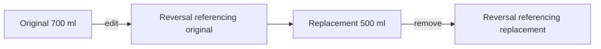

# Hydration model and business rules

[Documentation hub](README.md) · [Backend](backend.md) · [Domain implementation notes](../lib/domain/hydration/README.md)

## Event semantics

| Event                                       | Meaning                                                                       | Current input                                       |
| ------------------------------------------- | ----------------------------------------------------------------------------- | --------------------------------------------------- |
| `bottle_completed`                          | Full normal fill was finished; snapshot volume and count one completed bottle | Web full, NFC full, physical button                 |
| `manual_intake`                             | Explicit positive volume; does not count a completed bottle                   | Web half, NFC half, lower-level event API           |
| `adjustment`                                | Nonzero signed correction volume                                              | Lower-level event API                               |
| `event_reversed`                            | Audit record excluding the referenced original from effective history         | Reversal API and recording edit/remove              |
| `fill_started`, `refill`, `bottle_finished` | Legacy cycle semantics, still projected for historical compatibility          | Historical reads, not new normal client event types |

The normal-fill rule is `typical_fill_ml ?? capacity_ml`. Completion snapshots
that amount into the event. Changing a bottle tomorrow must not change yesterday's
intake. For a 700 ml normal fill, full adds 700 ml and one completed bottle; half
adds 350 ml and zero completed bottles. Half is rounded using `Math.round` and is
at least 1 ml. The server derives these amounts for product recording actions.

Persist integer milliliters, never floating-point ounces. `oz` means US fluid
ounces: one equals 29.5735295625 ml. Display rounds ounces to one decimal; storage
conversion rounds to the nearest integer ml. See [volume.ts](../lib/units/volume.ts).

## Effective immutable history

The edit is atomic: append a reversal and replacement with `corrects_event_id`
pointing to the prior version. The replacement retains source, event type, bottle
and device. Repeated edits form a chain. Removal reverses the active leaf. Normal
history hides superseded/reversal rows, while audit history retains them.

To calculate intake, exclude reversed originals and reversal audit rows before
summing effective credit. Do not both remove an original and subtract its volume
again. `fill_started` is not credited intake. Future events are excluded from
present-time projections. Use the shared [effective-events](../lib/domain/hydration/effective-events.ts)
and [recording-history](../lib/domain/hydration/recording-history.ts) helpers.

## Time, goals and windows

- `occurred_at` is when hydration happened; it determines ordering and the local day.
- `received_at` is the server receipt/audit timestamp. Stored timestamps are `timestamptz`.
- The member's IANA timezone defines calendar boundaries and DST conversion.
- Goals are date-effective (`effective_from`/`effective_until`). Use the goal for
  the day being projected, not today's goal for all history.
- Pace uses profile wake time and the active goal's target time, falling back to
  profile target where that path specifies it. A target at/before wake is treated
  as next-day by the shared expected-intake calculation. Accounting still uses
  the member's local calendar day; no separate overnight ledger exists.

Ordinary capture permits an occurrence up to seven days old and five minutes
in the future. That transport window does not govern user recording edits:
edits permit up to ten years of history, require an active historical goal, and
reject future times. Correction inputs use local date/time and the user's timezone;
nonexistent DST wall times are rejected, and unchanged repeated-hour timestamps
are preserved. See [change-hydration-recording.ts](../lib/application/hydration/change-hydration-recording.ts).

## Idempotency and rapid repeats

A retry represents the same action: keep its key and original payload. A new
intentional action needs a new key. Keys are user-scoped for normal events;
physical-device RPCs additionally scope them to the device. A conflicting replay
is not permission to create a fresh key automatically.

NFC full completions have a separate 60-second rapid-repeat confirmation. It
asks whether the user really finished another bottle; it is not a replacement
for idempotency. The same key protects against lost responses and duplicate taps.

## Pace and recommendations

[expected-intake.ts](../lib/domain/coaching/expected-intake.ts) linearly interpolates
expected intake between wake and target. [hydration-status.ts](../lib/domain/coaching/hydration-status.ts)
uses tolerance `max(100 ml, 5% of goal)`: below expected minus tolerance is behind;
above expected plus tolerance is ahead; the inclusive middle band is on track.
Reaching the goal takes precedence.

Today, physical-device status and notifications reuse the shared numerical
functions. Transport labels can differ (`goal-reached` versus `goal_met`), but
not the underlying hydration math. A device response may show progress above
100%; the Today progress bar caps its rendered width at 100%.

[pace-recommendation.ts](../lib/domain/coaching/pace-recommendation.ts) selects
none/half/full from the shared deficit and normal fill. Message copy consumes
numerical results; it must not invent a competing threshold.

## Analytics

Trends accepts 7, 30 or 90 local days, defaulting to 30. Eligible history starts
at the later of the requested start and the first relevant event/goal. Goal rate
uses eligible historical goal days. Rolling averages include zero-intake active
days and label partial windows. An unfinished today does not prematurely break
a streak active through yesterday. Bottle timing uses effective completions and
a circular time-of-day average after enough coherent samples.

Inspect [hydration-analytics.ts](../lib/application/analytics/hydration-analytics.ts)
and the domain tests before changing denominators, historical ranges or streaks.
Different aggregates have deliberate eligibility rules; do not substitute one
view's denominator for another's.
