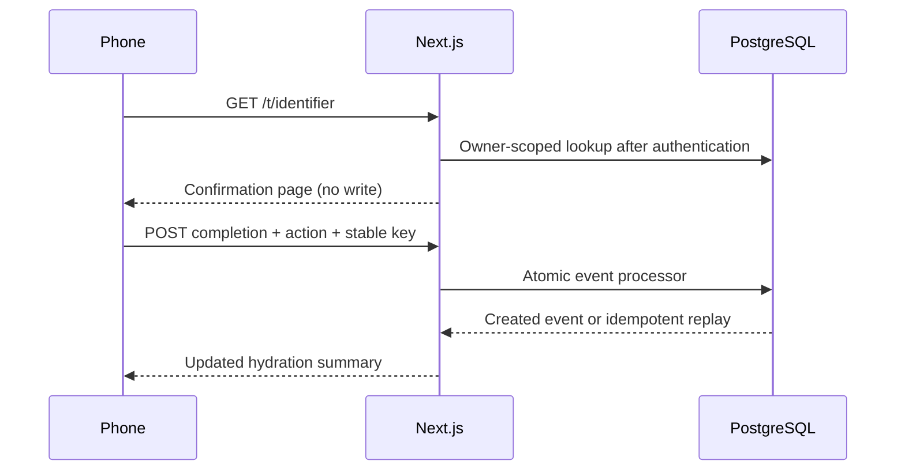

# NFC tags and pilot activation

[Documentation hub](README.md) · [Hydration rules](hydration.md) · [API reference](api-reference.md)

The Device area provisions and manages NFC tags for validating the future
HydroPOP Charm gesture. The user scans the tag, reviews a mobile confirmation
page, and explicitly chooses **Record one bottle** or **Record half**. Only an
authenticated confirmation POST records hydration. Opening, refreshing,
navigating back to, viewing Today, or cancelling never records hydration and
never changes tag state.

Every tag retains its secure identifier: 32 cryptographically random bytes
encoded as a 43-character base64url string. Its URL is a secret locator.
HydroPOP validates its format, stores only its lowercase SHA-256 digest, and
resolves it through an exact unique-index lookup scoped to the authenticated
owner. The raw token is returned only by create and rotate API responses and
cannot be recovered from the database afterward. The pilot interface
intentionally hides that advanced URL and shows only the friendly URL; existing
secure URLs and the rotation API remain backward compatible.

For the friends-and-family pilot, a tag may also have a memorable friendly code
such as `bea-kitchen`. Friendly codes are normalized to lowercase and are not
secret credentials. They resolve only after authentication and only among the
signed-in owner’s active tags, so different users may independently use the
same code. Codes are permanently reserved per user, including after a code
change or revocation. This prevents an older physical tag URL from becoming
valid again accidentally. Changing a friendly code invalidates its previous
friendly URL immediately without rotating the secure identifier. Rotating the
secure identifier does not change the friendly URL. Revocation disables both.

Tag management supports:

- creation for the authenticated user’s active primary bottle;
- optional labels, friendly pilot codes, and bottle reassignment;
- revocation without deleting the tag or hydration history;
- last confirmed-use display through `last_scanned_at`.

For this MVP, `last_scanned_at` means the timestamp of the latest successful
confirmed full-bottle NFC completion. A read-only scan, half intake, View Today,
or Cancel does not update it.

The NFC completion adapter accepts only the identifier, semantic `full` or
`half` action, occurrence timestamp, idempotency key, and an explicit
rapid-repeat confirmation flag. It derives the user and bottle on the server
and calls the same atomic hydration processor used by the normal event API. A
full action creates `bottle_completed`; the processor derives and snapshots
`typical_fill_ml ?? capacity_ml`. A half action reuses `manual_intake` and the
server calculates `round((typical_fill_ml ?? capacity_ml) / 2)` in integer
milliliters. The browser never supplies the user, bottle, or volume. Half intake
adds hydration without increasing the completed-bottle count and remains
reversible through immutable history. Reusing an idempotency key returns the
original event. A second effective full completion for the same bottle within
60 seconds shows a warning and requires another deliberate confirmation.

While Today is visible and online, a small pilot controller checks for
cross-device updates every five seconds. It pauses while hidden or offline,
refreshes promptly after focus, visibility return, or local hydration changes,
and prevents overlapping requests. This temporary polling can later be replaced
by realtime subscriptions or device synchronization.

## Writing and testing a physical NFC tag

1. Create a tag with a friendly code under `/device/nfc`.
2. Copy the displayed friendly NFC URL.
3. Open an NFC-writing app that supports URL/URI records.
4. Choose to write a URL/URI record.
5. Paste the HydroPOP URL and write it to the tag.
6. Scan and test the complete authenticated confirmation flow.
7. Do not lock the physical tag during early validation.

Local URLs use `NEXT_PUBLIC_SITE_URL=http://localhost:3000`, producing
`http://localhost:3000/t/{identifier}`. Production must set
`NEXT_PUBLIC_SITE_URL=https://hydropop-lake.vercel.app`, producing
`https://hydropop-lake.vercel.app/t/{identifier}`. URL construction uses one
validated origin utility, removes a trailing slash, has no fallback Vercel
domain, and fails during Next startup/build if the value is missing or invalid.

Verify the same canonical origin manually in both places before provisioning
physical tags:

- Vercel Production environment:
  `NEXT_PUBLIC_SITE_URL=https://hydropop-lake.vercel.app`
- Supabase Authentication URL configuration: site URL and permitted redirect
  URLs for `https://hydropop-lake.vercel.app`

The transport mapping is intentionally simple:

- NFC full confirmation → `bottle_completed`
- NFC half confirmation → `manual_intake` with a server-calculated volume
- physical-button intentional completion request → `bottle_completed`
- physical-button short status request → read-only status, zero hydration

The hydration engine and immutable event remain identical; only the client
transport changes. Browser-based NFC writing, Bluetooth, native mobile code,
and a simulated electronic charm are not part of this phase.

## Identifier lifecycle

| Action                | Secure URL                               | Friendly URL                                       | History               |
| --------------------- | ---------------------------------------- | -------------------------------------------------- | --------------------- |
| Create                | New random locator, issued once          | Optional owner-scoped code                         | No hydration recorded |
| Change friendly code  | Unchanged                                | Old URL stops resolving; old code remains reserved | Preserved             |
| Rotate secure locator | Old locator invalid; new one issued once | Unchanged                                          | Preserved             |
| Revoke                | Unavailable                              | Unavailable                                        | Preserved             |

Friendly codes are 3–32 lowercase letters/digits with single hyphens between
segments; reserved route-like words are rejected. See
[nfc-friendly-code.ts](../lib/contracts/nfc-friendly-code.ts).

## Near-zero setup pilot

`/t/pilot` is resolved in the signed-in owner's namespace. Setup can create or
reassign that owner's active pilot tag together with the primary bottle. Existing
accounts can explicitly activate it through `POST /api/v1/nfc-tags/pilot/activate`.
A previously revoked or conflicting reserved pilot tag is not silently reactivated.
Opening the URL alone does not activate the tag or record water.

The setup and activation implementation is in
[the near-zero setup migration](../supabase/migrations/20260802120000_add_near_zero_setup_pilot_activation.sql).
[resolve-nfc-scan.ts](../lib/application/nfc/resolve-nfc-scan.ts) requires an active
tag and an owned, active **primary** bottle. Assigning a tag to a bottle does not
bypass that scan-time requirement.

## End-to-end confirmation

## Troubleshooting and acceptance

- Wrong account or unknown/revoked tag: expect unavailable, not another owner's details.
- URL points at localhost: rewrite the tag with the intended reachable deployment URL.
- Bottle unavailable: check ownership, archive state and whether it remains primary.
- Old friendly URL fails after rename: expected; rewrite the physical tag. Do not free the reserved old code.
- Duplicate prompt: confirm only if another full bottle was actually completed; retain the same request key when retrying a lost response.
- Last confirmed use looks old after a half recording: expected; only successful full NFC completion advances that timestamp.

On a development account, test scan → login → setup/activation → confirmation,
full, half, retry of the same request, rapid-repeat warning, Cancel/View Today,
rename, rotate and revoke. Verify refreshing or reopening a URL never records.
Relevant tests contain `nfc` in [tests/unit](../tests/unit) and
[tests/integration](../tests/integration); browser tests cover entry/auth routing.
Physical tag writing and OS scan handling still require a real phone/tag.
