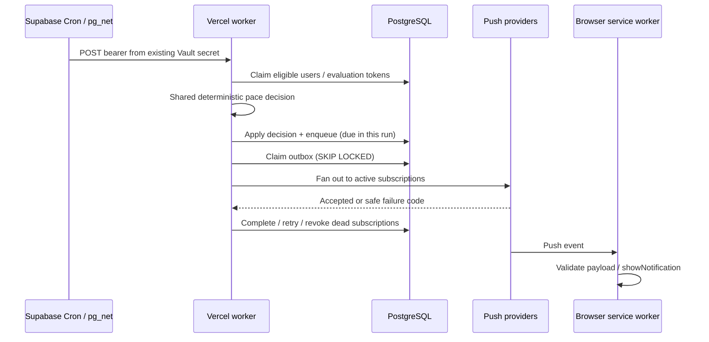

# PWA and Web Push notifications

[Documentation hub](README.md) · [Operations](operations.md) · [API reference](api-reference.md)

## User experience

Notifications are opt-in at `/settings/notifications`. The page manages the current
browser/app subscription separately from overall reminders: enable/reconnect this
device, disable this device, send a current-device test, pause/resume all reminders,
and select Gentle/Balanced/Frequent intensity.

An ordinary iOS tab gets installation guidance before capability rejection.
The installed Home Screen app must have Notification/PushManager/service-worker
support and granted permission. Permission is requested only in an explicit
user action. Browser subscription presence and active server registration are
separate states; reconnect reconciles an existing browser subscription with the
backend rather than assuming it was registered successfully.

## Adaptive policy

The backend uses the same expected-intake and meaningful-pace tolerance as Today.
It uses the member's wake time, date-effective goal/target time, IANA timezone,
primary bottle, effective hydration and persisted reminder state.

| Intensity          | Behind repeat | On track | Ahead   | Accepted reminders per local day |
| ------------------ | ------------- | -------- | ------- | -------------------------------- |
| Gentle             | 90 minutes    | 4 hours  | 4 hours | 4                                |
| Balanced (default) | 60 minutes    | 3 hours  | 4 hours | 6                                |
| Frequent           | 45 minutes    | 2 hours  | 3 hours | 8                                |

A new meaningful behind episode can send at the next evaluation, subject to at
least 45 minutes since any attempted/accepted pace reminder. Continuing behind
uses its repeat interval. Recovery ends the episode; threshold bouncing still
respects the global cooldown. Supportive states conservatively wait their full
interval after any prior category; their first reminder waits from wake time.

Recent effective hydration suppresses behind reminders for 20 minutes and
supportive reminders for 40 minutes. Goal completion stops pace reminders. Missing
goal/bottle/schedule, disabled preferences, no active device, outside-window,
daily cap, cooldown or pending delivery prevents a new reminder. Missing setup is
not replaced by a second hardcoded schedule. The 15-minute scheduler determines
when an eligible decision is next evaluated, so delivery is not exact to the minute.

Source: [pace-reminder.ts](../lib/domain/coaching/pace-reminder.ts).

## End-to-end worker

The [POST worker](../app/api/internal/push-reminders/run/route.ts) authenticates
before calling narrow Vault-authorized RPCs with a publishable-key client. Default
batches claim up to 50 evaluation candidates and 25 due outbox items. Evaluation
leases prevent immediate reclaims; delivery claims use tokens and SKIP LOCKED.
One user decision fans out to up to ten active subscriptions.

The [adaptive migration](../supabase/migrations/20260905130000_adaptive_push_reminders.sql)
sets new outbox rows due at evaluation time, so evaluation and delivery can happen
in the same invocation. It cancels queued advice after opt-out, ended days/windows,
goal completion or intervening hydration. A pending row blocks another user-level
decision until it completes or recovers.

## Delivery and retries

- 404/410 and structurally invalid stored subscriptions retire only that subscription.
- Transient failures use bounded exponential retry; scheduling availability is
  observed on a later worker run, not a separate per-minute scheduler.
- Successful subscription IDs are retained so a retry targets remaining devices.
- A user's daily count advances once when at least one subscription is accepted,
  including partial-success attempts.
- Stale processing claims recover after 15 minutes; repeatedly abandoned claims
  stop at the retry limit of five attempts.
- The sender has a 10-second request timeout and a 900-second TTL.

A crash after push acceptance but before SQL completion can cause another
acceptance on retry. The database protocol is idempotent; external push transport
is not exactly-once. The shared pace tag limits visible duplicates where supported.

Current-device tests bypass the reminder state machine and daily cap. They must
not enable other devices, advance cadence, or write hydration.

## Service-worker navigation

There is one `/sw.js`, registered at `/` with `updateViaCache: "none"`. Install
precaches the offline page/icons, activates updates with `skipWaiting`, and claims
clients during activation. Navigation is network-first with an offline fallback;
private responses are not cached as a dashboard data store.

Payload parsing rejects malformed/oversized or unexpected targets. Pace messages
open `/today?record=1&source=push`; tests open `/today`. Click handling validates the
same-origin target, navigates before focusing, and falls back from stale clients.
The chooser removes the consumed query via native History API without another
server navigation. Neither push receipt nor clicking records water.

## Diagnosing an absent reminder

Open the private Notifications page first. It reports browser/server registration,
active-device count, overall preference, last evaluation, observed pace, last
reminder and push acceptance, next eligible time, count today, window and reason.

| Observation                                              | Interpretation / next step                                                    |
| -------------------------------------------------------- | ----------------------------------------------------------------------------- |
| `notifications_disabled`                                 | Overall opt-in is paused; do not auto-enable it                               |
| `no_active_subscription`                                 | Enable/reconnect a supported device                                           |
| `worker_not_run`                                         | No recent observation (30-minute threshold); inspect Cron and HTTP results    |
| `pending_delivery`                                       | Inspect outbox status, retry timing and stale-claim recovery                  |
| `hydrated_recently`                                      | Intentional quiet period after an effective recording                         |
| `behind_cooldown`, `on_track_cooldown`, `ahead_cooldown` | Wait until eligible; scheduler evaluates at quarter-hours                     |
| `outside_notification_window`, `no_schedule`             | Check profile wake/target and timezone                                        |
| `goal_complete`, `daily_limit`                           | Intentional local-day suppression                                             |
| Accepted timestamp but no phone display                  | Check installed-app identity, permission, Focus, connectivity and OS delivery |

These are last-observed diagnostics, not a live browser pace calculation. Next
eligibility can change after hydration, corrections, profile changes or a delayed
worker. A successful Cron SQL statement only proves the HTTP request was queued;
inspect pg_net's HTTP status and worker counters separately.

## Configuration and historical evidence

[Getting started](getting-started.md) lists environment/Vault names. Use the
[operations runbook](operations.md) before enabling or repairing Cron. The initial
secret-provisioning template is different from the repair template that reuses
an existing Vault entry. Do not create another named scheduler or rotate VAPID
keys to troubleshoot a permission problem.

On September 5, the linked project's missing pg_cron/pg_net installation was
repaired, the new migration and app were deployed, and the 18:23 UTC verification
request returned `evaluated=2`, `enqueued=2`, `processed=2`, `delivered=2`.
All three subscriptions (two iOS, one macOS) received push-provider acceptance;
the user confirmed phone display. The automatic 18:30 UTC Cron run succeeded with
HTTP 200, evaluated both users, and sent no new reminder because both were cooling
down. Those are dated observations, **not a September 8 live-health assertion**.

The user also reported a blank Today view on the first notification tap. A
follow-up navigation fix was deployed and passed mobile WebKit regression tests;
physical retesting of that fix was not confirmed in the restoration session.
See the [audit](push-notification-audit.md) and
[restoration record](push-production-restoration.md).

## Physical-device verification

1. iPhone tab: check installation guidance. Home Screen app: check permission,
   browser subscription and server registration independently.
2. Test the current device with the app backgrounded/phone locked. Confirm actual
   display, not only server acceptance; tests must leave cadence unchanged.
3. After an app update, fully close/reopen the installed app. Tap a pace reminder:
   Today and Record Water should load, with no hydration written automatically.
4. Verify one scheduled user reminder can reach desktop and phone while advancing
   the user count once. Disable one device and verify the other remains active.
5. Check quiet periods, supportive cadence and goal-complete suppression over the
   member's real schedule. Use a development account for deliberate test recordings.

Browser emulation and service-worker unit tests do not prove lock-screen delivery,
Focus behavior or installed-app navigation on a physical phone.
